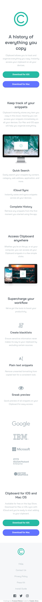

# Frontend Mentor - Clipboard landing page solution

This is a solution to the [Clipboard landing page challenge on Frontend Mentor](https://www.frontendmentor.io/challenges/clipboard-landing-page-5cc9bccd6c4c91111378ecb9). Frontend Mentor challenges help you improve your coding skills by building realistic projects. 

## Table of contents

  - [The challenge](#the-challenge)
  - [Screenshot](#screenshot)
  - [Links](#links)
  - [Built with](#built-with)
  - [What I learned](#what-i-learned)
  - [Continued development](#continued-development)
- [Author](#author)

## Overview

### The challenge

Users should be able to:

- View the optimal layout for the site depending on their device's screen size
- See hover states for all interactive elements on the page

### Screenshot

### Links

- Solution URL: 
- Live Site URL: https://claudioalvesmachado.github.io/clipboard-landing-page/

### Built with

- Semantic HTML5 markup
- Sass
- Flexbox
- Mobile-first workflow

### What I learned

How to use basic Sass in my project.

### Continued development

My focus now is to learn more about Sass and the general front-end architecture.

## Author

- Frontend Mentor - [@claudioalvesmachado](https://www.frontendmentor.io/profile/claudioalvesmachado")
